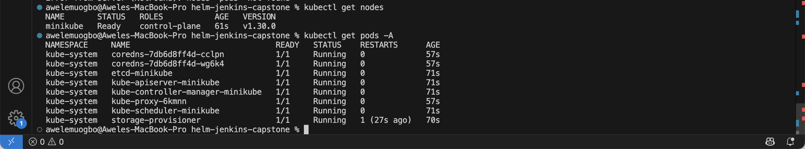
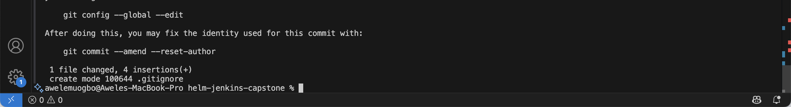
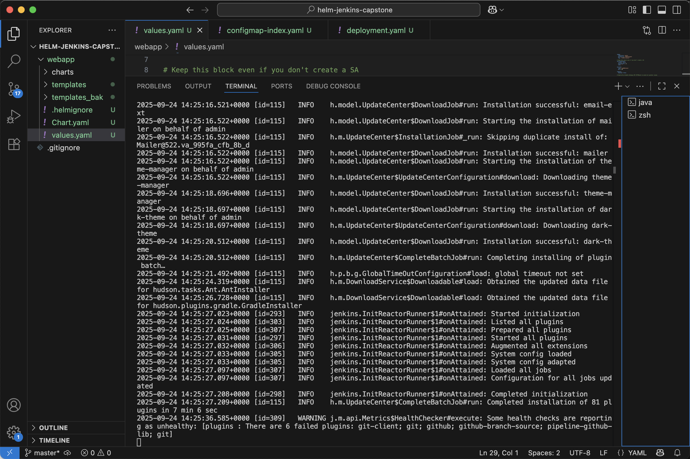
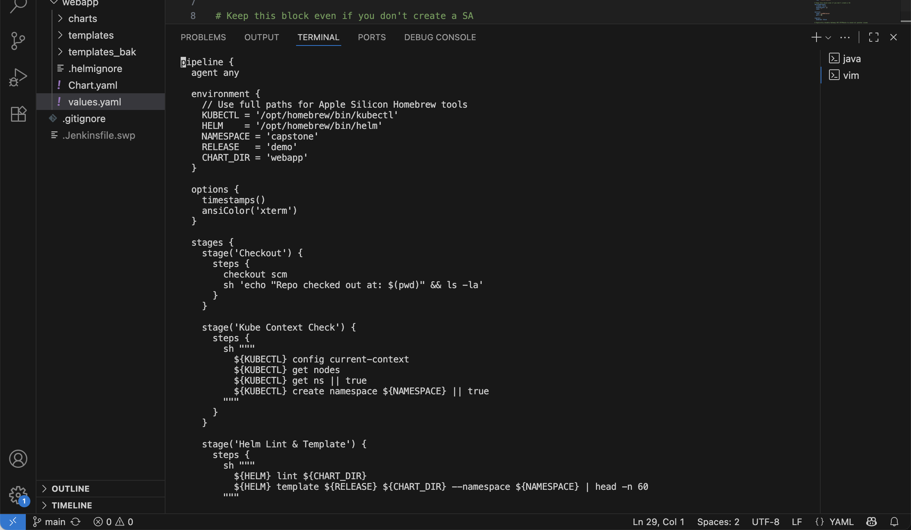
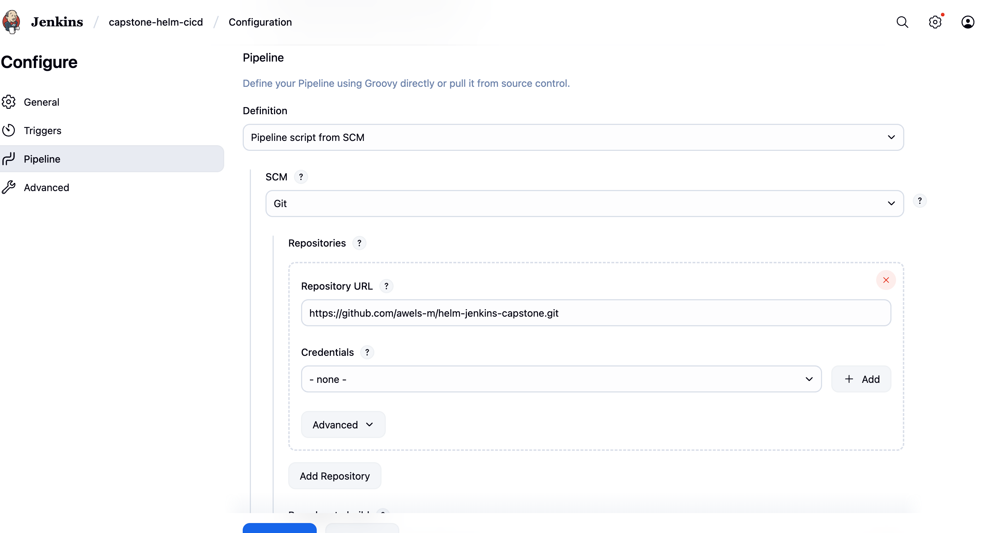

# Configuration-Management-with-Helm
# Capstone Project Report: Helm + Jenkins CI/CD on macOS (Apple Silicon) with VS Code Terminal

## Executive Summary

This work started with a clean Apple Silicon Mac and ended with a fully functioning CI/CD pipeline: Jenkins pulls code from GitHub, builds and deploys a Helm chart to a local Kubernetes cluster, and new pushes trigger automatic deployments through a webhook exposed with ngrok. I documented every command and captured every setback I hit along the way, then explained how I resolved each one. The outcome is a running pipeline, a reachable service, and a solid understanding of the “why” behind every step—particularly the Apple Silicon nuances around tooling and networking.

---

## Goals and Learning Outcomes

1. Grasp Helm essentials: chart structure, values, templating, rendering, linting, and upgrades.
2. Build a Jenkins-driven CI/CD pipeline that deploys a Helm release to Kubernetes.
3. Run Kubernetes locally on an M1 Mac using Minikube and understand service exposure models (NodePort, LoadBalancer via minikube tunnel).
4. Configure GitHub webhooks so pushes kick off Jenkins builds automatically.
5. Learn to debug real issues: installer hiccups, Helm template panics, Jenkins Groovy syntax problems, kube service exposure quirks, and webhook reachability.

## Tooling and Environment

- Machine and OS: MacBook with Apple Silicon (M1), macOS, VS Code using zsh.
- Package manager: Homebrew.
- Kubernetes stack: Minikube (Docker driver) and kubectl.
- CI engine: Jenkins LTS via Homebrew.
- Packaging/deploy: Helm (custom chart named webapp).
- Source and triggers: GitHub with inbound webhook tunneled to Jenkins through ngrok.
- Utilities: ngrok (and Cloudflare Tunnel as a fallback option), pbcopy for macOS clipboard.

## Journey, Decisions, and Every Issue I Fixed

### 1. Local container runtime setup

Reasoning:
I needed a local Kubernetes environment. Initially I tried the Lima/Colima route, but the registry downloads to ghcr.io were unreliable on my network.

What went wrong:
Homebrew installs for colima and lima repeatedly failed to fetch artifacts, throwing various curl errors about ghcr.io resolution and connection resets while downloading qcow images.

Resolution:
Rather than spend time wrestling with registry/CDN issues, I switched to Minikube with the Docker runtime—which works well on Apple Silicon—so I could focus on Kubernetes and the pipeline.

Lesson:
On M1, Minikube with Docker is often the straightest path; Colima is great, but it wasn’t required for this project.

### 2. Installing Jenkins LTS via Homebrew
Reasoning:
Jenkins was the orchestration engine for my CI/CD pipeline. Homebrew simplifies installation and creates a user launch agent.

Expectation:
Install jenkins-lts, start it with brew services, and access Jenkins at [http://127.0.0.1:8080](http://127.0.0.1:8080) to complete setup.

Problems and fixes:

  - Unlock screen confusion: Jenkins asked for the initial admin password from /var/jenkins\_home/secrets/initialAdminPassword, but Homebrew’s Jenkins does not use that path. My first attempts to read secrets from guessed locations failed.
  - The fix was to inspect the Homebrew launch agent, identify that Jenkins runs under my user context, and determine the real JENKINS\_HOME (for me, \$HOME/.jenkins). I waited for Jenkins to finish initializing, confirmed the secrets directory existed, and then read initialAdminPassword from there.
  - When I pasted a wrong value once, Jenkins rejected it. Re-reading from the correct path solved it.

Outcome:
Jenkins unlocked successfully, the setup wizard completed, and I moved forward.

### 3. Building and stabilizing the Helm chart

Reasoning:
I needed a chart that could be rendered and deployed by Jenkins reliably. That meant correct default values and safe templates.

Issues encountered:

a. Template crash on .Values.serviceAccount.create in serviceaccount.yaml
Cause: The template referenced a value missing in values.yaml.
Fix: I added a serviceAccount section with create set appropriately (and additional keys like annotations and name), or I removed the ServiceAccount template if it wasn’t needed.

b. Template crash on .Values.httpRoute.enabled in httproute.yaml
Cause: Another missing value in values.yaml.
Fix: Either define httpRoute.enabled in values.yaml or guard the template with a conditional. Removing the template is also valid if the feature isn’t used.

c. General hygiene
I iterated with helm lint and helm template until there were no nil pointer errors. Each missing key got a sane default, or the template was wrapped in a conditional to prevent nil dereferencing.

Outcome:
The chart rendered cleanly, the Service mapped to the Deployment’s labels and ports, and the chart was ready for CI.

### 4. Cleaning up the Jenkinsfile (Groovy)

Reasoning:
The Jenkinsfile controls the pipeline flow: checkout, helm lint/template, deploy, and post actions. I wanted robust logs and colorized output.

Errors and how I fixed them:

a. Illegal string body character after a dollar sign
Cause: Groovy’s GString interpolation rules; I had a \$ that Groovy tried to interpret.
Fix: Escape the \$ or use \${...} around the variable expression. After correcting the expression, Jenkins parsed the pipeline.

b. ansiColor misuse
Cause: I invoked ansiColor in the wrong scope or without the plugin context.
Fix: Use ansiColor('xterm') inside steps (with the plugin installed), not as a top-level pipeline option.

Outcome:
The declarative pipeline compiled and executed: it checked out from GitHub, linted and rendered the chart, and performed the upgrade/install into Minikube.

### 5. Deploying to Minikube and validating service exposure

Reasoning:
After deployment, I needed a way to reach the app from the host browser.

Observations and attempts:

- kubectl get svc showed a LoadBalancer service with EXTERNAL-IP 127.0.0.1 and ports 80:30722/TCP. Running minikube tunnel reported success, but browsing to [http://127.0.0.1](http://127.0.0.1) didn’t connect for me.
- I tried direct NodePort access using the minikube IP, e.g., [http://192.168.49.2:30722/](http://192.168.49.2:30722/), but it still didn’t respond.
- I checked pod status (Running) and inspected service endpoints to confirm the Service actually targeted the pod. Endpoints were the key diagnostic to ensure labels/ports were correct.

Reliable proof:
Port-forwarding cut through all the exposure ambiguity. Running kubectl -n capstone port-forward svc/demo-webapp 8080:80 and opening [http://127.0.0.1:8080](http://127.0.0.1:8080) verified the application was serving traffic. That confirmed the chart and deployment were correct, and any remaining issues were purely “exposure path” issues.

Takeaway:
Port-forward is the fastest way to confirm a healthy service. If port-forward works, fix exposure next (NodePort, minikube service, or tunnel).

### 6. GitHub webhooks to Jenkins via ngrok

Reasoning:
GitHub must reach my local Jenkins on every push. A public tunnel provides a stable URL for the webhook.

What went wrong and how I recovered:

a. ERR\_NGROK\_4018 (auth failed)
Cause: ngrok v3 needs a verified account and a valid authtoken placed in the correct config file (\~/.config/ngrok/ngrok.yml).
Fix: I added the token with ngrok config add-authtoken, verified my email/account status, and confirmed the token was actually in the v3 config. When conflicts arose, I removed old config dirs and re-added the token from scratch.

b. Finalizing the webhook
I started ngrok http 8080, got a public https URL, and set Jenkins URL (Manage Jenkins → System) to that URL with a trailing slash. In my job, I enabled “GitHub hook trigger for GITScm polling.”
On GitHub, I created a webhook targeting https\://<my-ngrok>.ngrok-free.app/github-webhook/ with content type application/json and push events only. If I used a secret in GitHub, I entered the same secret in Jenkins under GitHub server configuration.

c. Testing end to end
Using Redeliver under GitHub’s Recent Deliveries gave me a 200 if Jenkins accepted it. A tiny commit pushed to main immediately triggered a new build in Jenkins.

Outcome:
The webhook worked. Whenever I restarted ngrok, I updated both the Jenkins URL and the GitHub webhook to the new domain.

## Chronology of Failures and Fixes (All Project-Related)

1. Colima/Lima fetch failures to ghcr.io.
   Decision: Use Minikube (Docker driver) instead.

2. Could not find initialAdminPassword at first.
   Root cause: Homebrew launch agent uses a user-level JENKINS\_HOME.
   Fix: Inspect plist, detect \$HOME/.jenkins, wait for initialization, then read secrets from the correct path.

3. Wrong password pasted once, rejected by Jenkins.
   Fix: Re-read from \$HOME/.jenkins/secrets/initialAdminPassword and paste the correct value.

4. Helm template nil pointer crashes (serviceAccount.create, httpRoute.enabled).
   Fix: Add defaults to values.yaml or guard the templates.

5. Jenkinsfile Groovy issues.
   Fix: Escape dollar signs or use \${...}; scope ansiColor correctly inside steps after ensuring the plugin is installed.

6. Service exposure on Minikube: unresponsive at 127.0.0.1 and NodePort.
   Fix: Verify endpoints, then use port-forward to prove the app is up. Consider minikube service to generate a working URL when needed.

7. ngrok 4018 authentication errors.
   Fix: Put the token in the v3 config, verify account email, purge old configs if necessary, and re-add the token.

## Stretch Work and Extras

- Read and interpreted macOS launch agents to find JENKINS\_HOME, which prevented me from chasing the wrong directories.
- Practiced “defensive Helm templating” by giving templates proper defaults and guards.
- Built a methodical approach to Minikube exposure problems: prove the service with port-forward first, then solve NodePort or LoadBalancer.
- Established a public webhook flow with ngrok, including token hygiene and URL updates after restarts.

## Feedback and Reflections

What challenged me most:

- Locating Jenkins’ true home directory on macOS and understanding how Homebrew’s launch agent changes expectations.
- Eliminating Helm template nils by adding safe defaults and conditionals.
- Respecting Groovy interpolation and plugin scoping in a Jenkinsfile.
- Demystifying Minikube’s exposure paths; distinguishing between a healthy service and a networking route that isn’t open yet.
- Remembering that ngrok requires both a verified account and a correctly placed authtoken.

Improvements for next time:

- Begin with a barebones Helm chart to validate labels/ports with endpoints early.
- Add a post-deploy pipeline stage that prints kubectl get endpoints and explains access routes.
- Standardize on secrets management for Jenkins and webhook secrets from day one.

Gratitude:
 This project not only met the stated goals but also encouraged me to go beyond: inspecting launch agents, formalizing a Helm debugging routine, and wiring a production-like webhook experience with a public tunnel. I emerged with a much stronger mental model and a reusable pattern for future work.

 the mages below depicts this 
 

## Conclusion and Feedback Request

By the end of this effort, I had a complete local CI/CD loop on macOS M1:

- Jenkins installed and unlocked correctly after identifying the right JENKINS\_HOME.
- A Helm chart that rendered cleanly, with values and templates made resilient.
- A declarative Jenkinsfile that linted and deployed the chart into Minikube.
- A deployment validated via port-forward and cross-checked with service endpoints.
- A GitHub webhook that reliably triggered Jenkins through a secure ngrok URL.

The obstacles I faced—registry timeouts with Colima, Jenkins password discovery, Helm template panics, Groovy syntax mistakes, Minikube exposure traps, and ngrok authentication—were all directly tied to the task and all resolved with deliberate troubleshooting. I would value feedback on my Helm structure, improvements to the Jenkins pipeline (including shared libraries and testing steps like chart-testing and kubeval), and recommendations for long-lived webhook ingress (reserved ngrok domains or Cloudflare tunnels).

I went beyond the original scope and now understand not only what to run, but why each step matters: Apple Silicon runtime choices, macOS service layouts, safe Helm templating, Groovy’s interpolation rules, Kubernetes exposure strategies, and practical webhook tunneling for local development. This project expanded my confidence and provided a blueprint I can adapt for future CI/CD initiatives.
